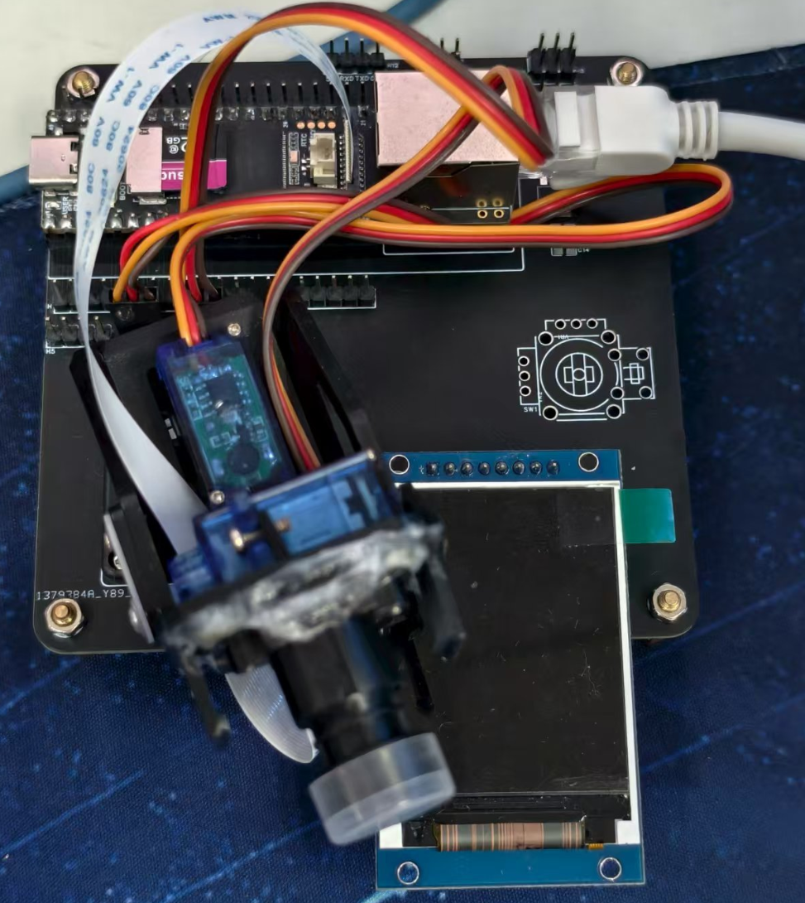

# Intelligent_Recognition_Client

> 基于 Rockchip RKNN 的智能识别客户端：集视频采集、目标检测、TCP 通信与云台控制于一体，适配 RK 平台嵌入式设备。

<p align="left">
  
  
  
  
  
  
  
  
</p>

---

## 📋 项目概述

### 🎯 项目架构

本项目采用**分布式PC-客户端架构**，分为两大部分：

| 部分 | 描述 | 仓库链接 |
|------|------|--------|
| **📸 RV1106终端** | 基于瑞芯微RV1106的网络摄像头终端软件 ⭐ **本仓库** | [Intelligent_Recognition_Client](https://github.com/Tomorrow-star-618/Intelligent_Recognition_Client) |
| **🖥️ RK3576客户端** | 基于RK3576的视频监控PC客户端 | [Linux-QT-RTSP](https://github.com/Tomorrow-star-618/Linux-QT-RTSP) |

---

<div align="center">
  
  <p><i>基于立创 EDA 设计的 PCB 实物转接板平台，无缝适配 RV1106 与外部硬件扩展</i></p>
</div>

---

## 📋 目录
- [✨ 核心功能](#-核心功能)
- [🛠️ 开发环境](#️-开发环境)
- [📚 使用教程](#-使用教程)
- [🏗️ 框架设计](#️-框架设计)
- [📁 项目结构](#-项目结构)
- [🚀 应用场景](#-应用场景)
- [📄 许可证](#-许可证)

---

## ✨ 核心功能
本项目是一个面向嵌入式平台的智能视觉识别系统，核心功能包括：

- **🎥 视频流管道 (MPP 硬件加速)**：
  - 基于 Rockchip MPP (Media Process Platform) 多媒体库深度开发，实现了 **ISP、RGA、NPU 与 VPU 四大硬件单元的全速并行**。
  - **ISP 视频采集**：高效捕捉前端图像数据。
  - **RGA 转换加速**：使用 RGA 硬件进行图像格式转换 (NV12->RGB888) 与自动缩放插络，零 CPU 消耗完成预处理。
  - **NPU 智能推理**：RKNN 提供底层 AI 算力。
  - **VPU 硬件编码**：对叠加了检测框后的最终画面进行 H.264 硬件视频编码。
  - 最终实现 **从 1920x1080 图像采集、推理、OSD 绘制到编码、RTSP 推流全流程，稳定达到 30FPS** 的卓越性能。

- **🎯 实时多目标检测 (AI 智能分析)**：
  - 基于 YOLOv5 算法和 Rockchip NPU (RKNN) 硬件加速，支持高达 80 种 COCO 类别目标的实时检测。
  - **区域检测 (ROI)**：支持设置特定关注区域，仅对出现在指定区域内的目标进行报警或记录。
  - **白名单物体过滤**：支持自定义对象列表（如仅检测“人”或“汽车”），有效滤除不相关的干扰目标。

- **📦 目标结果聚合与限流发送**：
  - 系统在 `Control` 模块中统一获取、聚合同一帧画面内的所有目标结果。
  - 采用时间戳限频策略（默认发送频率 1Hz），可根据网络状况动态配置发包间隔，有效降低网络带宽占用。

- **🌐 全功能网络交互 (两段式连接)**：
  - **UDP 广播发现** (端口 8888)：设备自动监听广播请求，返回运行状态及能力集，真正实现上位机的“免配置、一键扫描发现”。
  - **TCP 可靠通信** (端口 8890)：建立结构化的检测摘要传输与控制命令接收通道，内部集成异常断开后的自动重连机制。

- **🎛️ 云台联动与调度**：
  - 预留基于 `Servo` 的两自由度云台(PTZ)控制接口，配合 AI 识别结果，可以轻松扩展为智能目标跟踪（人脸跟踪、人形追踪）。

- **🛡️ 稳定与高可维护性**：
  - 优雅处理 Linux 系统信号 (`SIGTERM/SIGINT`)，保证退出时正确释放硬件资源(MPI、RGA 等)。
  - 多线程流水线模型，各司其职，有效应对嵌入式平台算力受限的情况。

---

## 🛠️ 开发环境
我们**强烈推荐**使用以下环境配置以获得最佳开发体验：

- **开发工具**：[Visual Studio Code](https://code.visualstudio.com/) + **Remote - SSH** 插件
- **操作系统**：推荐在 **Windows (或 Mac) 上使用 WSL2 - Ubuntu 22.04** 作为编译服务器
- **交叉编译链**：官方 Luckfox SDK (包含 arm-rockchip830-linux-uclibcgnueabihf 跨平台编译工具链)
- **构建系统**：CMake 3.10 及以上版本
- **核心依赖库**：OpenCV 4.x、rknn_api 等

> 💡 **提示**：使用 VSCode 的 SSH 远程连接到 Ubuntu 22.04 编译机不仅编写代码体验流畅，还能通过按键一键驱动 `CMakeLists` 进行交叉编译，十分便利。

---

## � 使用教程
### 1) 安装依赖环境
参考官方环境搭建文档：<https://wiki.luckfox.com/zh/Luckfox-Pico/Luckfox-Pico-SDK>

```bash
sudo apt update && \
sudo apt-get install -y \
  git ssh make gcc gcc-multilib g++-multilib module-assistant expect g++ gawk texinfo \
  libssl-dev bison flex fakeroot cmake unzip gperf autoconf device-tree-compiler \
  libncurses5-dev pkg-config bc python-is-python3 passwd openssl openssh-server \
  openssh-client vim file cpio rsync curl
```

### 2) 获取最新的 SDK
```bash
git clone https://gitee.com/LuckfoxTECH/luckfox-pico.git
```

### 3) 拉取本工程
```bash
git clone https://github.com/Tomorrow-star-618/Intelligent_Recognition_Client.git
```

### 4) 进入代码并修改配置
- 修改 CMake 文件的 SDK_PATH，将此处路径设置为你第 2 步获取的官方 SDK（luckfox-pico）路径：
```cpp
set(SDK_PATH "/home/mingxing/luckfox-pico")
```
- 修改 `run.sh`，将此处 IP 地址修改为你 RV1106 开发板的 IP 地址：
```bash
scp -r install/ root@192.168.1.130:/root
```

### 5) 编译并运行
- 编译程序并将可执行程序传入开发板：
```bash
./run.sh
```
- 切换到 RV1106 开发板终端执行（设备将自动启动 UDP 发现和 RTSP 推流）：
```bash
cd /root/install
./Intelligent_Recognition_Client
```
- 上位机启动 UDP 发现，找到设备后自动建立 TCP 连接进行通信。

---

## 🏗️ 框架设计
```text
[Camera/VI]
     │
     ▼
Video(采集/预处理/RGA加速/RKNN推理/后处理)
     │  onDetectionSummary()
     ▼
Control(聚合/限频/调度) ──────► Servo(云台联动)
     │
     └──────────────► TcpClient(连接/自动重连/发送)
                         ▲
                         │ UDP发现
                    UdpDiscovery(端口8888)
```
- **通信模式**：
  - **两阶段连接**：
    1️⃣ UDP 发现阶段（端口 8888）：上位机广播 discovery_request，设备响应并返回设备信息。
    2️⃣ TCP 连接阶段（端口 8890）：上位机发送 connection_request，设备自动连接并通信。
- **线程模型**：
  - **主线程**：模块装配、命令交互与生命周期管理。
  - **Video 线程**：采集/推理/后处理，构建检测摘要并上报。
  - **TCP 线程**：维护连接、自动重连、发送/接收。
  - **UDP 线程**：监听发现请求、响应设备信息。
- **关键交互**：
  - `Video::setControl(Control*)` 绑定上报目标；
  - `Control::onDetectionSummary()` 聚合并限频；
  - `TcpClient::setControl(Control*)` 与 `TcpClient::sendData()` 对外通信。
  - `UdpDiscovery::setHostDiscoveredCallback()` 监听上位机连接请求。
- **发送节流**：
  - 基于时间戳的限频策略（静态局部变量实现），默认 1 Hz，可通过 `Video::setSendInterval(s)` 覆盖。

---

## 📁 项目结构
通过高度模块化的设计手段，项目源码结构及各模块依赖如下：

```text
Intelligent_Recognition_Client/
├── CMakeLists.txt              # 构建配置
├── run.sh                       # 快速编译及推送开发板的脚本
├── README.md                    # 本文档
├── PROJECT_STRUCTURE.md         # 详细的系统架构图文说明
├── 3rdparty/                    # 第三方组件 (如 DMA 物理内存分配器)
├── code/                        # ★ 核心源码目录
│   ├── include/                 # 项目级公共声明 (如 common.h)
│   ├── model/                   # RKNN 模型及 COCO 标志配置文件
│   ├── src/
│   │   └── main.cc              # ★ 主程序入口 (组装模块、处理退出信号)
│   └── modules/                 # ★ 业务功能模块
│       ├── video/               # 采集、预处理、RGA加速、RKNN推理主干逻辑
│       ├── yolo/                # AI推理算法：RKNN YOLOv5 推理及 NMS 后处理
│       ├── tcp/                 # TCP 网络客户端 (心跳保活、断线重连)
│       ├── udp_discovery/       # UDP 设备发现服务 (8888端口广播响应)
│       ├── control/             # 业务主控中心 (调度TCP、聚合报警数据)
│       └── servo/               # 舵机硬件控制 (PWM操作层)
├── include/                     # SDK头文件依赖 (RK 媒体接口、OpenCV等)
├── lib/                         # 平台预置库 (glibc/uclibc)
├── install/                     # cmake install 最终生成的部署目录
└── docs/                        # 技术详细手册、协议说明
```

---

## 🚀 应用场景
得益于轻量化、高实时性的代码设计，该项目可以广泛应用于以下真实场景：
- **💻 智能家居安防监控**：搭配 QT 客户端实现人形入侵检测及抓拍。
- **🤖 机器人视觉感知系统**：搭配底层控制板，把视频/检测信息通过 TCP 传递给 ROS / 导航算法端。
- **🏭 工业 AIoT 边缘网关**：布置于微型产线条，进行数量统计或物件防呆检测。
- **🎒 创客及学生教育**：作为熟悉 RKNN AI NPU 加速、Linux C/C++ 并发编程、Socket 网络的绝佳实践项目。

---

### 📧 技术支持

如有任何技术问题或建议，欢迎通过邮箱与我联系：

📮 **联系邮箱**: [13883124164@163.com](mailto:13883124164@163.com)

---

## 📄 许可证
本项目采用 [MIT License](LICENSE) 许可协议，您可以自由地使用、修改和分发代码。

---

<div align="center">
<b>⭐ 如果这个项目对你有帮助，请给它一个星标！</b>
</div>
